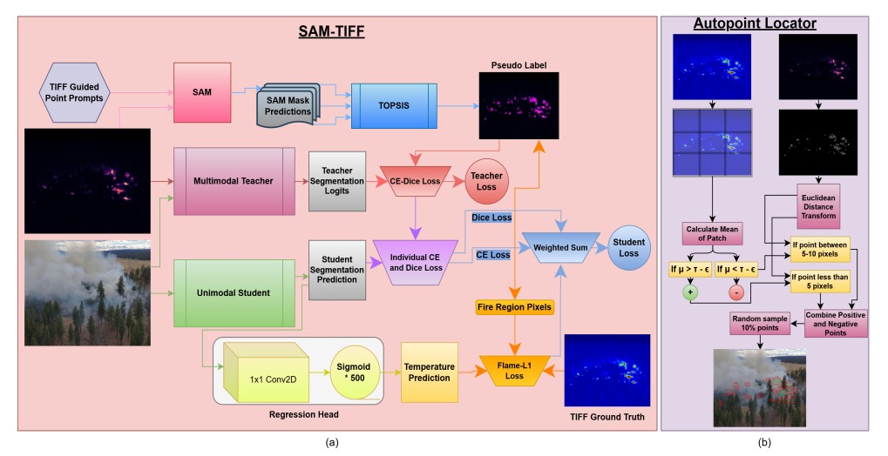

# SAM-TIFF Pseudo Label Mask Generation and Autopoint Prompt Generation
This repository shows the implementation from SAM-TIFF, where pseudo label masks are created using a hybrid approach of Meta AI's Segment Anything Model (SAM)-guided mask generation, and selection via TOPSIS, along with Canny edge detection and Otsu’s thresholding pipeline for automatic point prompt selection. 

This pipeline was developed by [Michael Marinaccio](https://github.com/mnmarinaccio) and used for work from the [SAM-TIFF Paper](https://arxiv.org/abs/2505.01638). The implementation for SAM-TIFF is found [here](https://arxiv.org/abs/2505.01638).

  

---

## Table of Contents
- [SAM-TIFF Pseudo Label Mask Generation and Autopoint Prompt Generation](#sam-tiff-pseudo-label-mask-generation-and-autopoint-prompt-generation)
  - [Table of Contents](#table-of-contents)
  - [How It Works](#how-it-works)
  - [Requirements](#requirements)
  - [Installation](#installation)
  - [Usage](#usage)
  - [License](#license)

---

## How It Works

The example Jupyter Notebook provided will work with the sample folder structure and sample images provided in this repository. However, if experimenting with your own images or with other FLAME 3 images, please make sure to run generate Otsu Masks and calibrate the TIFF files and Thermal JPGs using the tools found in the FLAME 3 Thresholding Utils Repository [here](https://github.com/mnmarinaccio/FLAME3_ThresholdingUtils).

## Requirements
- numpy==1.24.4
- torch==2.4.1
- matplotlib==3.7.5
- pandas==2.0.3
- opencv-python==4.11.0.86
- scipy==1.10.0
- scikit-image==0.21.0
- [Segment Anything Model (SAM) Github Repository](https://github.com/facebookresearch/segment-anything)

## Installation
git clone https://github.com/mnmarinaccio/SAMTIFF_AutopointPrompt.git  
cd SAMTIFF_AutopointPrompt

You can install the dependencies with:  
pip install -r requirements.txt

## Usage
For the examples, open the notebook in Jupyter and run all cells  
jupyter notebook SAM_TIFF_AutopointLocator.ipynb

## License
This project is licensed under the Apache 2.0 License. See the LICENSE file for details.

If you use these tools in your project, please cite this repository and the paper the tools were made for

@misc{marinaccio2025seeing,
    title={Seeing Heat with Color -- RGB-Only Wildfire Temperature Inference from SAM-Guided Multimodal Distillation using Radiometric Ground Truth},
    author={Michael Marinaccio and Fatemeh Afghah},
    year={2025},
    eprint={2505.01638},
    archivePrefix={arXiv},
    primaryClass={eess.IV}
}